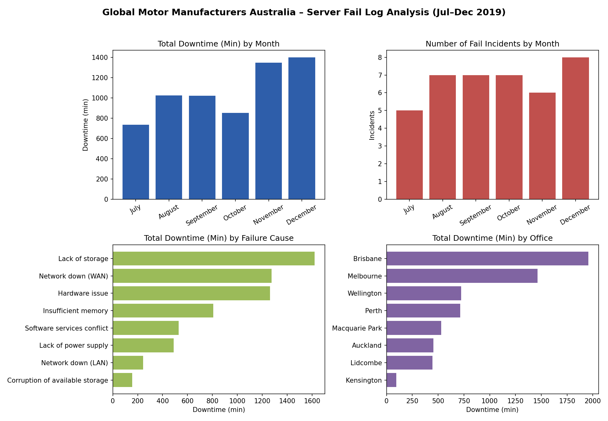
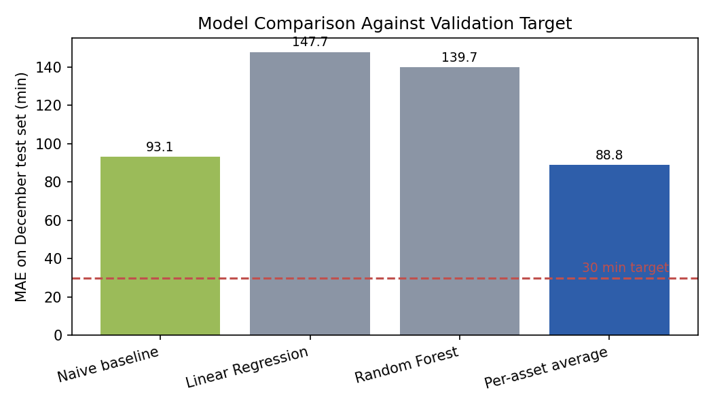

# GMMA Server Refresh: Fail Log Analysis

Data analysis case study completed as part of **Fujitsu's Technical Virtual Experience**, via Prosple/GradAustralia. The scenario and fail log data (a fictional client, "Global Motor Manufacturers Australia") were provided by the program as a simulated business problem, not a real Fujitsu client engagement. Presented here as a portfolio exercise in predictive modelling and data storytelling.

## Scenario

GMMA, a car part manufacturer with offices across Australia and New Zealand, was experiencing repeated server downtime. As part of the service delivery team preparing for the refresh planning meeting, the task was to analyse six months of fail logs, build a model to predict downtime, validate it against a target, and turn the findings into concrete recommendations.

## Task 1: Current State

The fail logs (July-December 2019) were plotted across four views: monthly downtime, monthly incident count, downtime by failure cause, and downtime by office.



Downtime rose steadily across the period, from 734 minutes in July to 1,402 minutes in December, with incidents climbing from 5 to 8 over the same months. Lack of storage, Network down (WAN) and Hardware issue were the leading causes, and Brisbane and Melbourne carried the highest cumulative downtime of any office.

## Task 2: Predictive Model

Downtime was modelled as a function of office and failure cause, one-hot encoded, using a July-November training set and a December (8-record) test set. Four approaches were compared:

| Model | MAE on December test set |
|---|---|
| Linear Regression | 147.7 min |
| Random Forest (300 trees) | 139.7 min |
| Naive baseline (training mean) | 93.1 min |
| **Per-asset historical average** | **88.8 min (best)** |



## Task 3: Validation

**Target: MAE under 30 minutes. Result: not met by any model**, with the best approach (per-asset average) landing at 88.8 minutes.

Rather than a modelling failure, this was flagged as a data-quality gap. The available fields (office, asset, failure cause) describe *where* and *what type* of failure occurred but not its severity, e.g. two "Hardware issue" events can differ by hundreds of minutes depending on the specific fault. Hitting the target reliably would need richer telemetry: asset age/support status, error codes, resolution times, or utilisation metrics ahead of each failure.

## Task 4: Recommendations

Three recommendations, combining the fail log findings with the client's Key Operational and Strategic Changes document (offices closing, 50% of servers already out of support with no planned replacement, a network capacity upgrade already scheduled):

1. **Prioritise the out-of-support fleet, starting with Brisbane and Melbourne.** These two offices carry the highest cumulative downtime, and the client has confirmed no replacement is planned this year. Recommend a risk-based compensating control (spares, proactive capacity monitoring, scheduled health checks) for the oldest assets there first.
2. **Re-sequence the planned network upgrade.** Network down (WAN) is a top-two cause of downtime, and a capacity upgrade is already planned across September and December. Recommend upgrading the worst WAN-affected offices in the first tranche rather than a generic split.
3. **Standardise storage/memory threshold alerting.** Lack of storage is the single largest cause of downtime by total minutes. Recommend automated alerting across all offices as a low-cost addition, rolled out alongside the office consolidation already underway.

## Tools used

Python (pandas, scikit-learn, matplotlib), Excel, Word

## Repo contents

```
images/
  fail-logs-current-state.png   Four-panel chart of current downtime state
  model-comparison.png          MAE comparison across the four models
server_downtime_analysis.py     Data loading, modelling and validation
GMMA_Server_Refresh_Analysis_Report.docx   Full written report
Task_Data__Server_Down_Data.xlsx           Source fail log data
```
