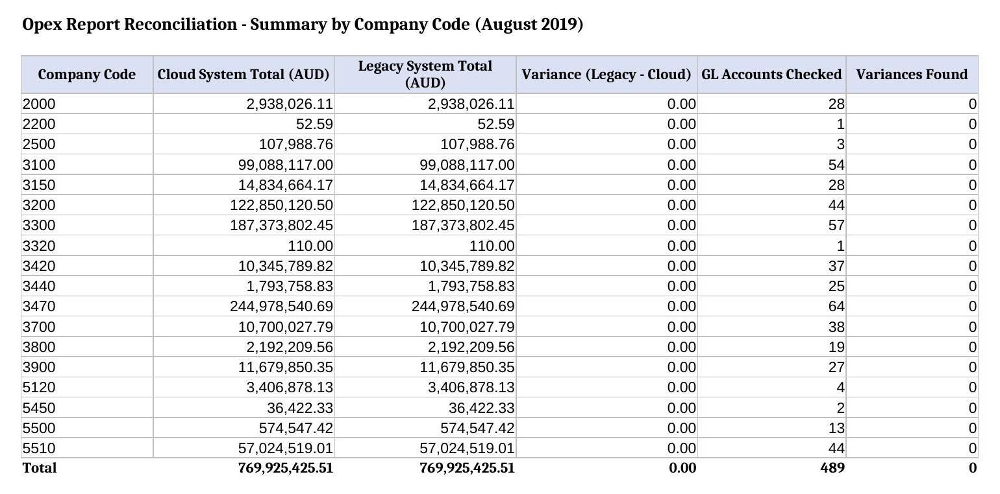
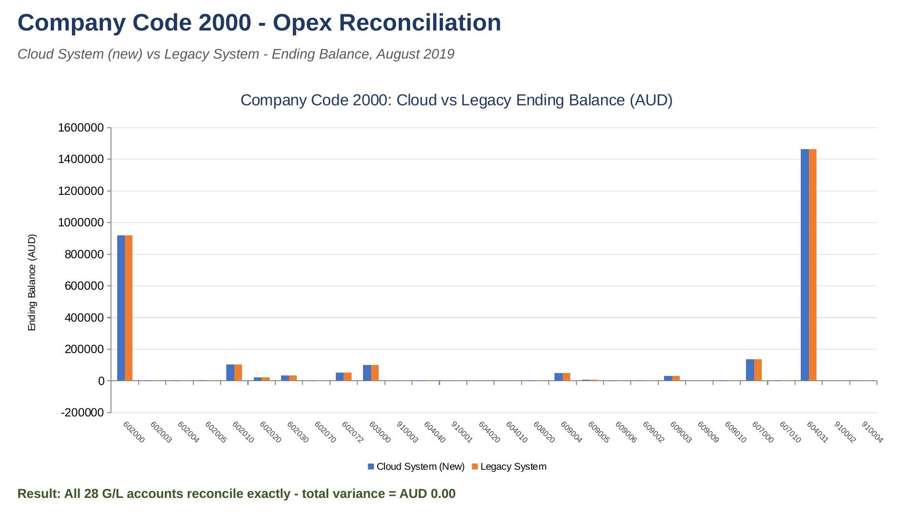
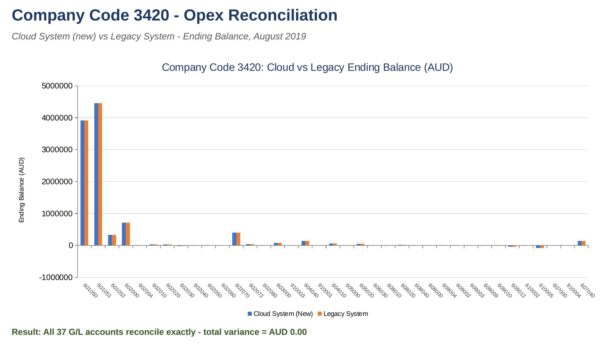

# Data Reconciliation - Capgemini Virtual Experience

Business analysis project completed as part of Capgemini's Data Reconciliation job simulation (via Forage). This was a simulated engagement using a scenario and dataset provided by the program, not live work inside a client's actual systems. It's presented here as a portfolio piece covering data validation, VLOOKUP-based reconciliation, and results visualisation.

## Scenario

A client migrated from a legacy system to a new cloud platform. Users can now generate management reports in the new cloud system with a single click, but the migration needs to be validated before anyone relies on those numbers. The client organises its data by company code (organisational subsections), with multiple G/L (general ledger) accounts under each one. The task was to confirm that the Opex Report for August 2019, generated in the new cloud system, matches the source data in the legacy system.

## Approach

- Built a unique lookup key per record by concatenating Company Code and G/L Account
- Used `VLOOKUP` to pull the corresponding legacy balance for every line in the cloud report
- Calculated the variance (legacy value minus cloud value) for all 489 line items across 18 company codes
- Rolled the results up into a company-code summary using `SUMIFS`/`COUNTIFS`, functioning as a pivot-style view
- Built clustered column charts comparing cloud vs. legacy values by G/L account, to visualise the result for two company codes

## Result

All 489 line items reconciled exactly, with zero variance across every company code. The new cloud system's Opex Report is accurate.



## Visualisation

Clustered column charts comparing the cloud system's ending balance against the legacy system's, by G/L account, for two sample company codes:





## Repo contents

```
Opex_Data_Reconciliation.xlsx      Full reconciliation workbook (VLOOKUP formulas, variance analysis, company code summary)
Opex_Reconciliation_Charts.pptx    Graphical comparison of cloud vs. legacy balances for company codes 2000 and 3420
images/                            Screenshots used in this README
```

## Tools used

Excel (VLOOKUP, SUMIFS, pivot-style summaries, charts), PowerPoint

## About this simulation

This is a Forage job simulation, an unofficial preview of the type of work done at Capgemini. It is not a real client engagement.
